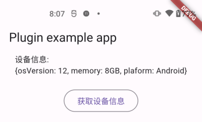

# Unify: Flutter-Native Hybrid Communication Framework

[中文说明](./README.zh-CN.md)

Unify is an efficient, flexible, and easy-to-use Flutter hybrid development framework designed to solve communication issues between Flutter and native modules. It supports platform-independent module abstraction, flexible implementation injection, automatic code generation, and other features, significantly improving the efficiency of hybrid development and reducing maintenance costs.

Unify is developed by Didi's international food delivery team and has been widely used in Didi's international food delivery and international travel business, effectively supporting the Flutter-based development process.

Key features:

- **Platform-independent module abstraction**: Allows developers to declare platform-independent module interfaces and entities using the Dart language.
- **Flexible implementation injection**: Developers can flexibly choose to inject native implementations (Android/iOS) or Flutter implementations.
- **Automatic code generation**: With a powerful code generation engine, Unify can automatically generate SDKs for unified calls across Flutter, Android, and iOS platforms.

Here's an example of declaring a native module using Unify:

```dart
@UniNativeModule()
abstract class DeviceInfoService {
  Future<DeviceInfoModel> getDeviceInfo();
}
```

Through Unify, the above Dart interface can be automatically mapped to Android and iOS platforms, and developers only need to focus on the specific implementation on each platform. When used in Flutter, the calling method is as simple and intuitive as a regular Flutter module:

```dart
DeviceInfoService.getDeviceInfo().then((deviceInfoModel) {
  print("${deviceInfoModel.encode()}");
});
```

The overall principle of Unify is as follows:


Unify can effectively solve some common problems in Flutter hybrid development, such as:

- Efficiently importing a large number of native modules into Flutter
- Efficiently importing a large number of Flutter modules into native code
- Solving the maintenance issue of a large number of channels
- Hybrid architecture layering with coexistence of native and Flutter

**Start using Unify now to make hybrid development more efficient!**

## Installation

Unify is a command developed using Dart.

Add `dev_dependencies` in the `pubspec.yaml` of your Flutter project:

```yaml
dev_dependencies:
  unify_flutter: latest_version
```

> Note: Currently, Unify has not been released on pub.dev. You can experience it through git dependency for now. It will be officially released on pub.dev in the future, so stay tuned.

Git dependency:

```yaml
dev_dependencies:
  unify_flutter:
    git: git@github.com:maxiee/Unify.git
```

Run `flutter pub get` to pull the dependencies. Then you can run Unify:

```sh
flutter pub run unify_flutter api
```

> Note: Running the Unify command usually requires a series of parameters. For specific usage, please refer to Getting Started.

## Getting Started

Follow these steps to quickly start using Unify to uniformly encapsulate a native SDK (including Android and iOS versions) and import it into Flutter.

> Reference example code: `example/01_uninativemodule_demo`

### Prerequisites

Before getting started, make sure your development environment meets the following conditions:

- Flutter 3 or above is installed
- For Android development, the Android development environment is configured
- For iOS development, the iOS development environment is configured

### Step 1: Clone the Example Project

First, clone the Unify project and enter the example directory:

```sh
git clone git@github.com:didi/Unify.git
cd ./Unify/01_uninativemodule_demo
```

`01_uninativemodule_demo` is a standard Flutter app project. Its features include:

- The native side (Android/iOS) implements a system information module respectively
- Use Unify to uniformly encapsulate native modules and import them into Flutter
- Perform unified calls on the Flutter side

### Step 2: Declare Unify Module

Notice that there is an `interface` directory in the project root, which is where Unify modules are declared. It contains two files:

1. `device_info_service.dart` - Declares the native module:

```dart
// device_info_service.dart
@UniNativeModule()
abstract class DeviceInfoService {
  /// Get device information
  Future<DeviceInfoModel> getDeviceInfo();
}
```

The `@UniNativeModule` annotation indicates that the implementation of this module is provided by the native side.

2. `device_info_model.dart` - Declares the return value model:

```dart
// device_info_model.dart
@UniModel()
class DeviceInfoModel {
  /// Operating system version
  String? osVersion;

  /// Memory information
  String? memory;

  /// Device model
  String? platform;
}
```

The `@UniModel` annotation indicates that this is a cross-platform data model.

### Step 3: Generate Cross-Platform Code

After completing the interface declaration, execute the following command to generate cross-platform code:

```sh
flutter pub run unify api\
  --input=`pwd`/interface \
  --dart_out=`pwd`/lib \
  --java_out=`pwd`/android/src/main/java/com/example/uninativemodule_demo \
  --java_package=com.example.uninativemodule_demo \
  --oc_out=`pwd`/ios/Classes \
  --dart_null_safety=true \
  --uniapi_prefix=UD
```

Command option description:

| Parameter          | Description                                                | Required |
|--------------------|-----------------------------------------------------------|----------|
| `input`            | Specifies the Unify interface declaration directory          | Y        |
| `dart_out`         | Specifies the Dart code output directory                    | Y        |
| `java_out`         | Specifies the Java code output directory                    | Android  |
| `java_package`     | Specifies the package name of the generated Java code       | Android  |
| `oc_out`           | Specifies the Objective-C code output directory             | iOS      |
| `dart_null_safety` | Whether to generate null-safe Dart code                     | Y        |
| `uniapi_prefix`    | Generated code prefix to avoid conflicts between libraries | N        |

After execution, Unify generates code for each platform in the corresponding directory.

### Step 4: Implement Native Modules

We need to provide the specific implementation for the generated native module interfaces:

- Android platform implementation class: [DeviceInfoServiceImpl.java](https://github.com/didi/Unify/blob/master/example/01_uninativemodule_demo/example/android/app/src/main/java/com/example/uninativemodule_demo_example/DeviceInfoServiceImpl.java)
- Android platform implementation registration: [MainActivity.java](https://github.com/didi/Unify/blob/master/example/01_uninativemodule_demo/example/android/app/src/main/java/com/example/uninativemodule_demo_example/MainActivity.java)

- iOS platform implementation class: [DeviceInfoServiceVendor.h](https://github.com/didi/Unify/blob/master/example/01_uninativemodule_demo/example/ios/Runner/DeviceInfoServiceVendor.h), [DeviceInfoServiceVendor.m](https://github.com/didi/Unify/blob/master/example/01_uninativemodule_demo/example/ios/Runner/DeviceInfoServiceVendor.m)
- iOS platform implementation registration: [AppDelegate.m](https://github.com/didi/Unify/blob/master/example/01_uninativemodule_demo/example/ios/Runner/AppDelegate.m)

You can refer to the example code for implementation.

### Step 5: Call in Flutter

Everything is ready! In the Flutter code, you can now directly call the native module encapsulated by Unify:

```dart
OutlinedButton(
  child: const Text("Get Device Info"),
  onPressed: () {
    DeviceInfoService.getDeviceInfo().then((deviceInfoModel) {
      setState(() {
        _platformVersion = "\n${deviceInfoModel.encode()}";
      });
    });
  },
),
```



At this point, you have successfully imported a native module using Unify and used it in Flutter. It's as simple and intuitive as calling a Flutter module!

### Summary

Through this example, we experienced the value brought by Unify:

1. `Unified Module Declaration`: Unified module interface declaration on any platform to avoid inconsistent implementations
2. `UniModel`: Supports cross-platform transparent data model transmission
3. Compared to Flutter's native channel approach:
    1. Avoids errors caused by manual parameter parsing
    2. Automatic alignment between Android and iOS
    3. Automatic generation of a large number of channels, easy to maintain
    4. Seamless serialization of complex entities, reducing management costs

## Decision Tree

We have summarized the following decision-making process:


## More Examples

In Getting Started, we provided the most basic and commonly used scenario of importing native implementations into Flutter. Unify's capabilities go far beyond that. From simple single SDK encapsulation to complex enterprise-level app large-scale module export, Unify can support it all.

We introduce these typical scenarios and business models through example applications:

| Case                                                                                                | Description                                                                                                  | Applicable Scenario                                                                                                        |
|-----------------------------------------------------------------------------------------------------|--------------------------------------------------------------------------------------------------------------|---------------------------------------------------------------------------------------------------------------------------|
| [01_uninativemodule_demo](https://github.com/didi/Unify/tree/master/example/01_uninativemodule_demo) | UniNativeModule demo                                                                                        | How to efficiently import a native module (Android/iOS dual-end implementation) into Flutter and achieve unified calling |
| [02_unifluttermodule_demo](https://github.com/didi/Unify/tree/master/example/02_unifluttermodule_demo) | UniFlutterModule demo                                                                                       | How to efficiently import a Flutter module into native (Android/iOS) and achieve unified calling                        |

## Documentation

For more advanced usage, please refer to the detailed documentation.

* For documentation, please refer to [Unify Documentation](doc/README.md).
* To quickly experience how to use it, please refer to [Getting Started](doc/02.快速开始/README.md).
* To understand the capabilities provided by Unify, please refer to [Basic Capabilities](doc/06.基础能力/README.md).
* To understand the design principles of Unify modules, please refer to [Principle Overview](doc/08.原理概述/README.md).
* For more usage instructions of Unify CLI, please refer to [CLI Usage Tutorial](doc/04.CLI使用教程.md).

> Note: We are also actively organizing the documentation. If you have any questions regarding usage or understanding, please feel free to submit an issue for feedback and discussion!

## License


Unify is distributed and used under the Apache-2.0 license. For more information, see the [License File](LICENSE).

## Members

R&D Team:

[maxiee](https://github.com/maxiee),
[zhugeafanti](https://github.com/zhugeafanti),
[piglet696](https://github.com/piglet696),
[zhaoxiaochun](https://github.com/zhaoxiaochun),
[ChengCheng-Hello](https://github.com/ChengCheng-Hello),
[windChaser618](https://github.com/windChaser618),
[bql88601485](https://github.com/bql88601485),
[newbiechen1024](https://github.com/newbiechen1024),
[xizhilang66](https://github.com/xizhilang66),
[UCPHszf](https://github.com/UCPHszf),
[QianfeiSir](https://github.com/QianfeiSir),
[jiawei1203](https://github.com/jiawei1203),
[Whanter](https://github.com/Whanter)

## Contribution

If you have any questions regarding usage or understanding, please feel free to submit an issue for feedback and discussion!

Your communication and contributions are welcome!