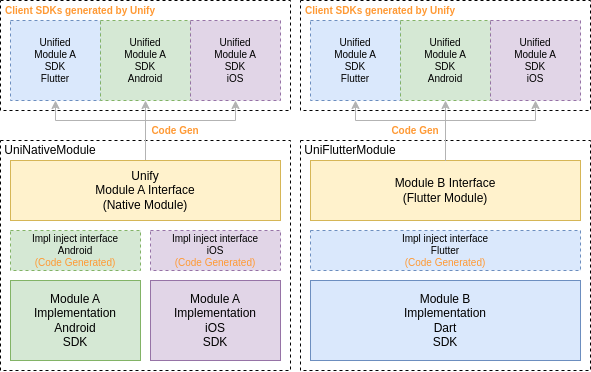
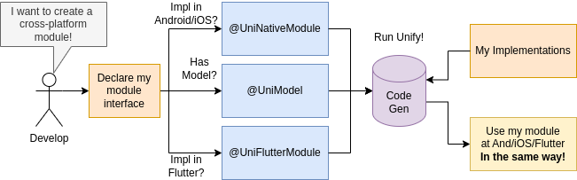

[English Version](): is working in progress...

# Unify：Flutter-原生混合通信

## 介绍

Unify 是一个 Flutter 代码生成器，解决 Flutter 混合开发场景下，原生模块与 Flutter 模块间的大规模通信问题。

Unify 允许开发者声明平台无关的模块抽象，灵活注入实现，并生成 Flutter、Android、iOS 多平台下统一调用 SDK。

基于 Unify 的代码生成技术，允许开发者使用 Dart 语言声明模块接口与实体。对于实现注入方式，开发者可选择注入原生实现（Android、iOS）或 Flutter 实现。

整体原理如下：



Unify 擅长解决：

- 大量原生模块高效导入 Flutter
- 大量 Flutter 模块高效导入原生
- 解决大量 Channel 难以维护的问题
- 原生与 Flutter 并存下的**混合架构分层**

Unify 由滴滴出行国际化外卖团队自研，广泛应用于滴滴国际化外卖及国际化出行业务。有效支撑业务 Flutter 大规模落地。

## Installation

Unify 是一个使用 Dart 开发的命令。

在 Flutter 工程的 `pubspec.yaml` 中添加 `dev_dependencies`：

```yaml
dev_dependencies:
  unify: latest_version
```

> 注：目前 Unify 尚未发布 pub.dev，可先通过 git 依赖方式体验。后续会正式发布 pub.dev，敬请期待。

git 依赖：

```yaml
dev_dependencies:
  unify:
    git: git@github.com:maxiee/Unify.git
```

执行 `flutter pub get` 拉取依赖。之后即可运行 Unify：

```sh
flutter pub run unify api
```

> 注：执行 Unify 命令通常需伴随一系列参数，具体可使用方式可参见 Getting Started。


## Getting Started

以最基础的使用场景为例：有一个原生 SDK，同时包含 Android、iOS 版本，开发者需要对其进行统一封装，并导入到 Flutter 中。

> 本例实例代码位于 `examples/01_uninativemodule_demo` 下。

运行 Demo：

首先 clone 工程，并进入 `01_uninativemodule_demo` 目录：

```sh
git clone git@github.com:didi/Unify.git
cd ./Unify/01_uninativemodule_demo
```

`01_uninativemodule_demo` 是一个普通的 Flutter App，其功能是：原生侧（Android/iOS）各实现一个系统信息模块，统一导入 Flutter，在 Flutter 中统一调用。

不同之处在于，**项目下有一个 interface 目录，这是我们声明 Unify 模块的地方**。其中包含两个类：

首先是一个模块声明，`@UniNativeModule` 表示该模块的实现由 Native 原生提供（NativeModule）：

```dart
// device_info_service.dart
@UniNativeModule()
abstract class DeviceInfoService {
  /// 获取设备信息
  Future<DeviceInfoModel> getDeviceInfo();
}
```

同时可以看到，`getDeviceInfo` 返回一个 `DeviceInfoModel`，声明如下：

```dart
// device_info_model.dart
@UniModel()
class DeviceInfoModel {
  /// 系统版本
  String? osVersion;

  /// 内存信息
  String? memory;

  /// 手机型号
  String? plaform;
}
```

这是什么意思呢？**使用 Unify 之后，开发者只需关注跨端统一模块的声明**，如果由原生侧提供实现使用 `@UniNativeModule` 注解，如果由 Flutter 侧提供实现使用 `@UniFlutterModule` 注解，如果使用复杂实体使用 `@UniModel` 注解。

接口声明好后，执行项目目录下的 `gen_uni_code.sh` 脚本：

```sh
flutter pub run unify api\
  --input=`pwd`/interface \
  --dart_out=`pwd`/lib \
  --java_out=`pwd`/android/src/main/java/com/example/uninativemodule_demo \
  --java_package=com.example.uninativemodule_demo \
  --oc_out=`pwd`/ios/Classes \
  --dart_null_safety=true \
  --uniapi_prefix=UD
```

这会调用 Unify 生成器。其中：

- `input`：指定接口输入目录
- `dart_out`：指定 Dart 部分输出目录
- `java_out`：指定 Java 部分输出目录
- `java_package`：指定对应的 Java 报名
- `oc_out`：iOS 的 Objective-C 输出目录
- `dart_null_safety`：是否启用空安全
- `uniapi_prefix`：（可选），生成器会生成一个 Unify 类，这里提供一个前缀，避免多个使用 Unify 的库间相互冲突。

执行后，在工程内会生成以下文件：

由于实现由原生侧注入，所以我们使用 `@UniNativeModule`，在原生侧生成供注入的接口：

- Android：[DeviceInfoService.java](https://github.com/didi/Unify/blob/master/examples/01_uninativemodule_demo/android/src/main/java/com/example/uninativemodule_demo/DeviceInfoService.java)
- iOS：[DeviceInfoService.h](https://github.com/didi/Unify/blob/master/examples/01_uninativemodule_demo/ios/Classes/DeviceInfoService.h)、[DeviceInfoService.m](https://github.com/didi/Unify/blob/master/examples/01_uninativemodule_demo/ios/Classes/DeviceInfoService.m)

有了这些接口，由开发者继承补充模块的原生代码实现：

- Android 实现类：[DeviceInfoServiceImpl.java](https://github.com/didi/Unify/blob/master/examples/01_uninativemodule_demo/example/android/app/src/main/java/com/example/uninativemodule_demo_example/DeviceInfoServiceImpl.java)
- Android 注册实现：[MainActivity.java](https://github.com/didi/Unify/blob/master/examples/01_uninativemodule_demo/example/android/app/src/main/java/com/example/uninativemodule_demo_example/MainActivity.java)

- iOS 实现类：[DeviceInfoServiceVendor.h](https://github.com/didi/Unify/blob/master/examples/01_uninativemodule_demo/example/ios/Runner/DeviceInfoServiceVendor.h)、[DeviceInfoServiceVendor.m](https://github.com/didi/Unify/blob/master/examples/01_uninativemodule_demo/example/ios/Runner/DeviceInfoServiceVendor.m)
- iOS 注册实现：[AppDelegate.m](https://github.com/didi/Unify/blob/master/examples/01_uninativemodule_demo/example/ios/Runner/AppDelegate.m)

我们可以看到，同时生成了跨端 `UniModel` 实体，**在各平台下都能直接使用 Model 类，由 Unify 抹平底层序列化传递**：

- Android：[DeviceInfoModel.java](https://github.com/didi/Unify/blob/master/examples/01_uninativemodule_demo/android/src/main/java/com/example/uninativemodule_demo/DeviceInfoModel.java)
- iOS：[DeviceInfoModel.h](https://github.com/didi/Unify/blob/master/examples/01_uninativemodule_demo/ios/Classes/DeviceInfoModel.h)、[DeviceInfoModel.m](https://github.com/didi/Unify/blob/master/examples/01_uninativemodule_demo/ios/Classes/DeviceInfoModel.m)
- Flutter：[device_info_model.dart](https://github.com/didi/Unify/blob/master/examples/01_uninativemodule_demo/lib/device_info_model.dart)

至此，便完成了**将一个原生模块统一导入 Flutter**！

在 Flutter 中，可以以统一方式调用：

```dart
OutlinedButton(
  child: const Text("获取设备信息"),
  onPressed: () {
    DeviceInfoService.getDeviceInfo().then((deviceInfoModel) {
      setState(() {
        _platformVersion = "\n${deviceInfoModel.encode()}";
      });
    });
  },
),
```


Bingo！是不是像调用一个 Flutter 模块一样清晰、简单！

乘热划一下重点，Unify 带来了哪些好处？

1. `统一模块声明`：在任何平台下，统一的模块，统一的接口，完全对其，避免实现不一致
2. `UniModel`：模块支持声明实体，跨平台生成实体类，无感透明跨端传输
3. 相较于 Flutter Channel，避免了：
    1. 手动解析参数已出错
    2. Android、iOS 双端难以对齐
    3. 大量 Channel 下不易维护
    4. 复杂实体序列化管理成本高

## Decision Tree

我们总结了如下决策流程：




## More Examples

在 Getting Started 中，给出了最基础、使用场景最多的【原生实现导入 Flutter】。Unify 的能力远不止这些。从简单的单一 SDK 封装，到复杂的企业级 App 大规模模块导出，Unify 都能够支持。

我们通过实例应用的方式，对这些典型场景及业务模式进行介绍：

|案例|说明|适用场景|
|---|---|---|
|[01_uninativemodule_demo](https://github.com/didi/Unify/tree/master/examples/01_uninativemodule_demo)|UniNativeModule 演示|如何将一个原生模块（Android/iOS双端实现）高效导入Flutter、实现统一调用|
|[02_unifluttermodule_demo](https://github.com/didi/Unify/tree/master/examples/02_unifluttermodule_demo)|UniFlutterModule 演示|如何将一个 Flutter 模块，高效导入原生（Android/iOS），实现统一调用|

## Documentation

对于更多高级用法，请参见详细文档。

* 查看文档请参考 [Unify文档](docs/README.md)。
* 想快速体验如何使用，请参考 [快速开始](docs/02.快速开始/README.md)。
* 想了解 Unify 提供哪些能力，请参考 [基础能力](docs/06.基础能力/README.md)。
* 想了解 Unify 模块设计原理，请参考 [原理概述](docs/08.原理概述/README.md)。
* 想了解更多 Unify CLI 的使用说明，请参考 [CLI 使用教程](docs/04.CLI 使用教程.md)。

> 注：目前我们也在积极整理文档，如果在使用、理解上有任何问题，欢迎提交 Issue 反馈、交流！

## 协议


Unify 基于 Apache-2.0 协议进行分发和使用，更多信息参见 [协议文件](LICENSE)。

## 成员

研发团队：

[maxiee](https://github.com/maxiee),
[zhugeafanti](https://github.com/zhugeafanti),
[piglet696](https://github.com/piglet696),
[zhaoxiaochun](https://github.com/zhaoxiaochun),
[ChengCheng-Hello](https://github.com/ChengCheng-Hello),
[windChaser618](https://github.com/windChaser618),
[bql88601485](https://github.com/bql88601485),
[newbiechen1024](https://github.com/newbiechen1024),
[xizhilang66](https://github.com/xizhilang66),
[UCPHszf](https://github.com/UCPHszf),
[QianfeiSir](https://github.com/QianfeiSir),
[jiawei1203](https://github.com/jiawei1203),
[Whanter](https://github.com/Whanter)

## Contribution

如果在使用、理解上有任何问题，欢迎提交 Issue 反馈、交流！

欢迎您的交流、贡献！

