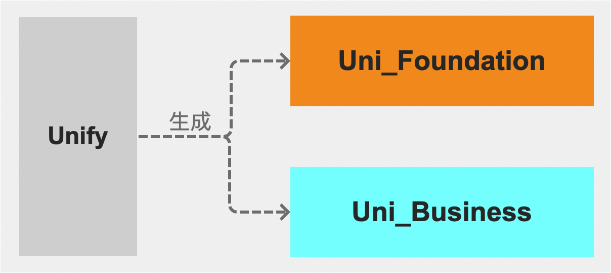

# 衍生模式 
在跨端场景中，仍然适合复用原则，避免重复造轮子。以 Unify 为底座，结合实践，我们得出下面的衍生模式：

* **Uni_Foundation**：平台基建 SDK 能力导入 Flutter 的桥接聚合层，多个不同业务线均可以使用，大家可以共建。
* **Uni_Business**：业务线自身特有能力导入 Flutter 的桥接聚合层，业务团队内部使用，团队内部自建。

如果您也有类似的场景，可以尝试这种模式，人效将会有所提升。

