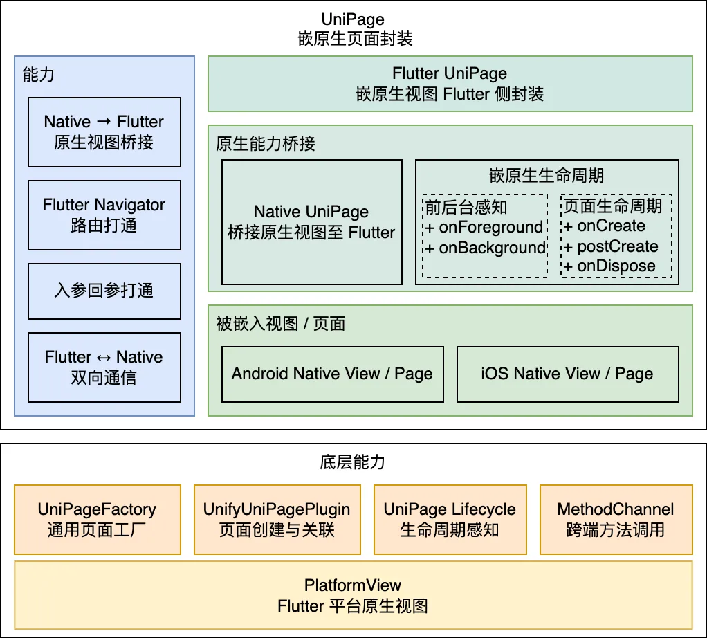
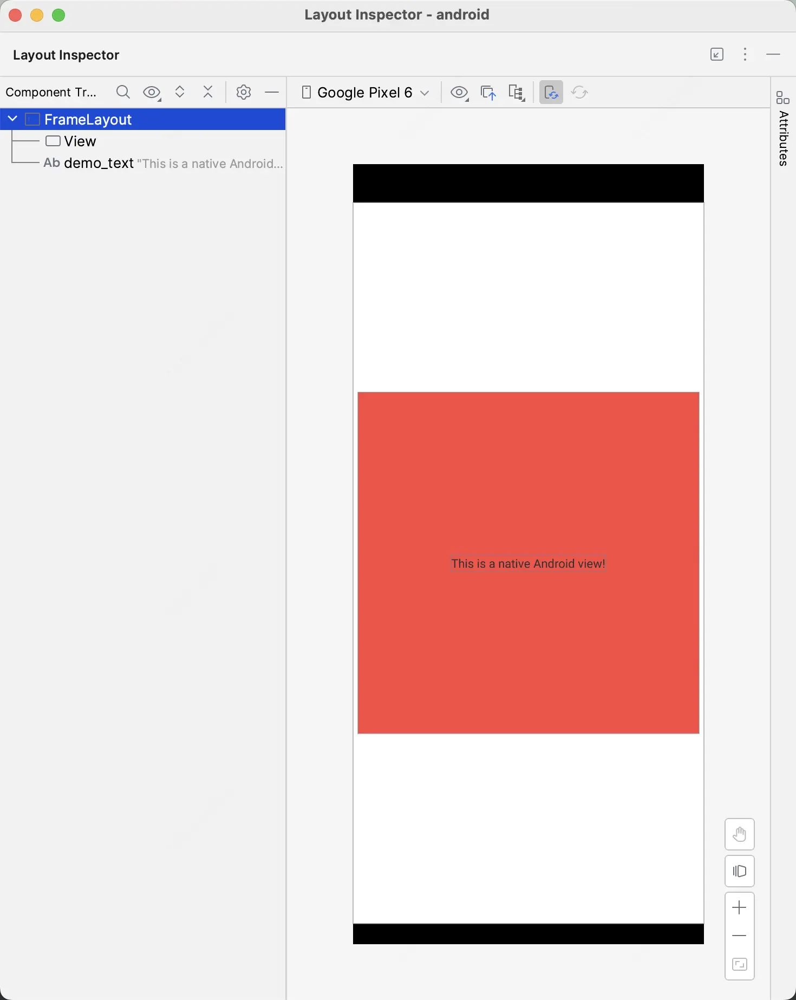
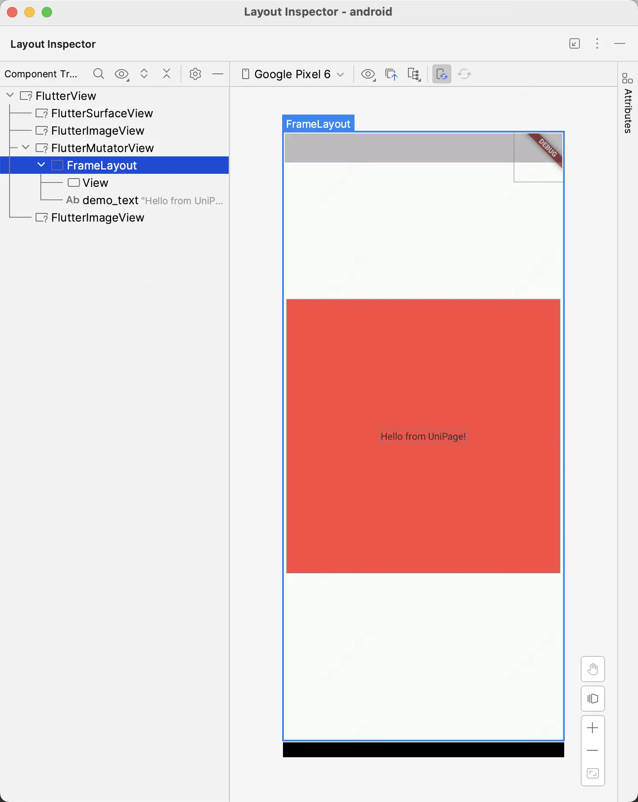

# Unify UniPage: Flutter 混合路由

UniPage 是一个高效的 Flutter 混合路由框架，作为混合开发解决方案 Unify 的一部分，提供一种创新、简洁的方式，将平台原生页面与 Flutter 无缝集成。通过将原生视图封装为 UniPage、直接使用 Flutter 的 Navigator 调度，混合开发的复杂度与维护成本均可大幅降低。

在大规模 Flutter 落地的过程中，尽管 Flutter 能满足大部分页面需求，但仍有部分原生页面牵涉到复杂的业务逻辑，或者大量使用底层 API，如地图、WebView 等页面，无法被 Flutter 完全取代。

除此之外，常见的混合路由通常针对 Flutter 初步落地设计，它们有一些不可避免的问题，例如：

- 路由逻辑复杂；
- 认知、维护成本高；
- 用户体验相对较差。

UniPage 正是为了解决这些问题而生。它拥有简洁、灵活而强大的整体架构，允许开发者在高 Flutter 覆盖度的场景下，低成本地复用原生页面，降低混合路由对开发者与用户的负担。UniPage 由滴滴出行国际化外卖团队自研，用于解决关键原生页面的 Flutter 化，向着全业务 Flutter 闭环的目标前进。

UniPage 的整体架构如下：



更详细的原理在 [原理详解](./doc/00.原理详解.md) 中提供，话不多说，立即开始使用吧！

## 安装

向 pubspec.yaml 中添加如下依赖：

```yaml
unify_uni_page: ^0.0.8
```

随后执行 `flutter pub get` 即可。

## 开始使用

接下来以一个场景为例，演示如何将一个原生页嵌入 Flutter：



### 步骤 1：创建原生视图

巧妇难为无米之炊，为了将原生视图嵌入 Flutter，首先需要创建对应的原生视图。

#### Android

创建一个继承 UniPage 的类 DemoUniPage：

```java
public class DemoUniPage extends UniPage {
    @Override
    public View onCreate() {
        return null;
    }

    @Override
    public void onDispose() {
        
    }
}
```

其中， `onCreate()` 的返回值就是 DemoUniPage 对应的视图，可以自由创建。例如，从布局 XML 文件创建，并设置内部的 TextView 显示 Flutter 侧传入的 `"demoText"` 参数：

```java
@Override
public View onCreate() {
    LayoutInflater inflater = LayoutInflater.from(getContext());
    FrameLayout demoLayout = (FrameLayout) inflater.inflate(R.layout.uni_page_demo, null, false);
    TextView demoText = demoLayout.findViewById(R.id.demo_text);
    demoText.setText((String) getCreationParams().get("demoText"));
    return demoLayout;
}
```

或者，直接使用 Java 创建：

```java
@Override
public View onCreate() {
    LinearLayout linearLayout = new LinearLayout(getContext());
    return linearLayout;
}
```

> [!IMPORTANT]
> `onCreate` 返回的 View 必须没有父组件（即 `getParent()` 必须为空），否则会直接闪退。

Demo 以使用 XML 文件为例。

#### iOS
创建一个继承 UniPage 子类比如叫UniPageDemo:

```objectivec
#import "UniPage.h"
@interface UniPageDemo : UniPage
@end

@implementation UniPageDemo
- (void)onCreate {
    [super onCreate];
    // Do any additional setup when creating the UniPage object.
}
@end
```
其中，`- (void)onCreate`函数可以实现创建想展示在`FlutterView`的原生组件，比如在添加一个`UILabel`组件 title ，你可以这样实现：

```objectivec
- (void)onCreate {
    [super onCreate];
    [self addSubview:self.title];
    ......
}
```
> 具体细节参见 example 中 ios 部分的`UniPageDemo.m`


### 步骤 2：创建 Flutter 页面

在 Flutter 侧，同样创建一个 DemoUniPage 类，然后和常规页面一样，继承 StatefulWidget，并在 State 里组装一个页面。

> [!NOTE]
> 类名相同并不强制，只是为了方便辨别。Scaffold 也不强制，可以依照应用需要，自由组装页面。

```dart
class DemoUniPage extends StatefulWidget {
  const DemoUniPage({Key? key}) : super(key: key);

  @override
  State<StatefulWidget> createState() => _DemoUniPageState();
}

class _DemoUniPageState extends State<DemoUniPage> {
  final UniPageController _controller = UniPageController();
  @override
  Widget build(BuildContext context) {
    return Scaffold(
      body: UniPage(
        'demo_uni_page',
        controller: _controller,
        createParams: {'demoText': ModalRoute.of(context)?.settings.arguments},
      ),
    );
  }

  @override
  void dispose() {
    _controller.dispose();
    super.dispose();
  }
}
```

这段代码中，使用到了 UniPageController 以及 UniPage。其中，前者是 UniPage 的控制器，可以用于 Flutter 与原生侧的通信，需要手动销毁；后者则是 UniPage 本体，创建时传入的 `'demo_uni_page'` 是它的唯一标识，它通过这个标识寻找原生视图。此外，我们还取出了传到页面的参数，并作为 `'demoText'` 传至原生侧。

### 步骤 3：原生关联 Flutter 页面

`'demo_uni_page'` 上面已经在 Flutter 中注册，却还没关联到原生。为了让 Flutter 能够根据这个标识找到原生视图，我们需要在 Flutter 启动前，将这个标识注册到 UniPage。

#### Android

推荐在应用 Application 的 `onCreate` 中进行注册：

```java
public class MainApplication extends FlutterApplication {
    @Override
    public void onCreate() {
        UnifyUniPagePlugin.registerUniPage("demo_uni_page", DemoUniPage.class);
        super.onCreate();
    }
}
```

像这样一行代码，就完成了 Android 原生视图与 Flutter 页面的关联。

> [!IMPORTANT]
> 注意，这里 `registerUniPage` 必须在 `onCreate` 之前进行。 `FlutterApplication.onCreate` 中会通知引擎进行初始化，初始化时引擎会从 `UnifyUniPagePlugin` 中获取已注册的页面关联。若初始化之后再注册，则会导致引擎找不到原生页面。

#### iOS

推荐在 `AppDelegate.m`中的`- (BOOL)application:didFinishLaunchingWithOptions:`中调用`UnifyUniPagePlugin`的`registerUniPage: viewType:`方法，完成注册，参考示例：

```objectivec
- (BOOL)application:(UIApplication *)application didFinishLaunchingWithOptions:(NSDictionary *)launchOptions {
  // The 'registerUniPage: viewType:' method of UnifyUniPagePlugin must be called before the 'registerWithRegistry:' method of GeneratedPluginRegistry
  [UnifyUniPagePlugin registerUniPage:[UniPageDemo class] viewType:@"demo"];
  [GeneratedPluginRegistrant registerWithRegistry:self];
  ......
}
```
> [!IMPORTANT]
> `registerUniPage: viewType:`方法调用一定要在`registerWithRegistry:'`方法之前。


### 步骤 4：Flutter 跳转！

完成关联后，在 Flutter 中跳转即可。这里我们还传入了一条字符串，按照我们上面的配置，它最后会被显示到布局里的 TextView 上：

```dart
Navigator.of(context).push(MaterialPageRoute(
  builder: (context) => const DemoUniPage(),
  settings: const RouteSettings(arguments: 'Hello from UniPage!'),
));
```

> [!NOTE]
> 当然，也可以在注册后使用 `pushNamed` 以命名路由形式跳转，或者使用任何其他已有的路由实现。

像这样就完成了 UniPage 的初步配置， `flutter run` 试试看吧！



## 使用技巧

以上是 UniPage 的基础使用方式。除此之外，还有一些能让 UniPage 更好用的技巧：

* 扩展嵌原生视图内容：由于 Flutter 的高度组件化，上述 Flutter 页面的布局可以完全自由发挥。例如，可向页面上组装 Flutter AppBar 或对话框蒙层等，将原生侧复杂的实现统一交由 Flutter 控制。

## 详细文档

更多 UniPage 的高级用法，可以参考以下文档：

* 关于 UniPage 原理，可参考 [原理详解](./doc/zh/00.原理详解.md) ；
* 关于底层 PlatformView 原理，即「原生视图如何嵌入 Flutter」，可参考 [PlatformView 原理详解](./doc/zh/01.PlatformView原理详解.md)
* 需要了解 UniPage 的生命周期，可参考 [生命周期感知](./doc/zh/02.生命周期感知.md) ；
* 需要进行方法调用，可参考 [双向通信](./doc/zh/03.双向通信.md) ；
* 需要在创建或返回时传递参数，可参考 [入参回参传递](./doc/zh/04.入参回参传递.md) ；
* 需要外部监听 UniPage 创建与销毁，请使用 [工厂监听器](./doc/zh/05.工厂监听器.md) ；

## 协议

## 参与贡献
