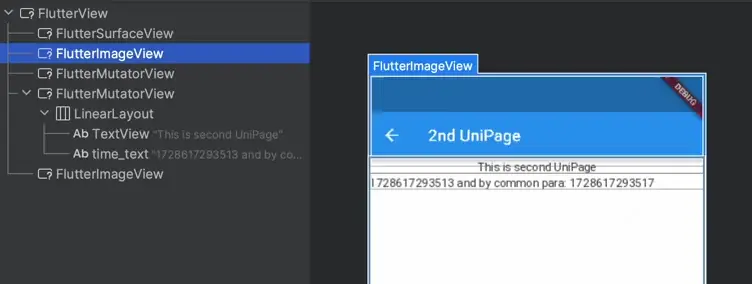
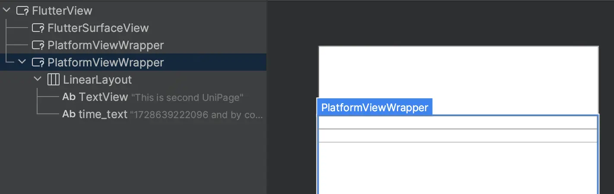

# PlatformView 原理详解

为了理解 PlatformView，需要从 Flutter 的渲染原理开始。对于系统而言，比起原生开发用到的一系列视图，Flutter 只是一块显示区域。系统只负责提供这块显示区域，具体的绘制完全由 Flutter 引擎进行，Flutter 画出来的内容，也不会转换成原生的视图结构。

这样的设计有利于多平台的*像素级*统一，却埋下了一个隐患：这片 Flutter 的渲染区域，难以渲染原生的视图。许多复杂原生实现，例如地图、导航、相机，既难以和 Flutter 画在这片区域的内容共存，又无法用 Flutter 完全重写，通常需要将原生视图嵌入 Flutter。

为了满足这个需要，Flutter 官方提供了 PlatformView 技术，允许 Flutter 获取原生视图，并将它渲染到 Flutter 的显示区域。UniPage 整合了 Android 与 iOS 的 PlatformView，可作为原生视图与 Flutter 的中间层，无缝地将原生视图渲染到 Flutter 的显示区域，而 UniPage 的具体行为，又与具体平台相关：

## Android 行为

在 Android 上，Flutter 一共提供了三种可能的实现：

- [Virtual Display](https://github.com/flutter/flutter/blob/master/docs/platforms/android/Virtual-Display.md) (VD)

- [Hybrid Composition](https://github.com/flutter/flutter/blob/master/docs/platforms/Hybrid-Composition.md) (HC)

- [Texture Layer Hybrid Composition](https://github.com/flutter/flutter/blob/master/docs/platforms/android/Texture-Layer-Hybrid-Composition.md) (TLHC)

其中，根据 Flutter 版本不同，UniPage 可能采用 HC 或 TLHC 实现，大体可以分为两种情况：

### Flutter 3.0 以下：HC

Hybrid Composition 的原理，类似于一个汉堡，原生视图是汉堡中间的肉饼，上下夹着两块透明的 Flutter 面包。在渲染时，如果 Flutter 内容挡住了肉饼，就画到上面的面包，反之如果被肉饼挡住，就会被画到下面的面包。这样，我们从面包顶往下看，看到的就是符合预期的、正确堆叠的内容。



如上图，布局层级里的 `FlutterImageView` 就是所谓的「Flutter 面包」，两张透明的纸。标题栏在文本上方，背景色则在文本下方，这些都会被正确地渲染到对应的 `FlutterImageView` 上， `FlutterMutatorView` 则是原生视图的容器，最后它们被拍扁成一个平面，原生视图就完美嵌入了 Flutter 的纸里。

不过，这一实现有两个小问题：

- 原生视图与 Flutter 引擎渲染线程不同，可能存在同步问题、导致闪烁等；
- 低于 Android 10 存在性能损失，Flutter 的渲染结果需要先从显存复制到内存，然后再复制进显存输出。

### Flutter 3.0 及以上：TLHC

Texture Layer Hybrid Composition 在 HC 的基础上，除了使用 `PlatformViewWrapper` 取代了 `FlutterMutatorView` 之外，还接管了原生视图的绘制。先看图：



虽然控件似乎都在布局树中，但是 Layout Inspector 看不到它们。这是因为， `PlatformViewWrapper` 重写了 `draw` 方法，神不知鬼不觉地把这些控件的 Canvas 从 Android 原生换成 Flutter，跟随 Flutter 渲染，这就进一步解决了 HC 的线程同步问题。

除此之外，通过 `PlatformViewWrapper` 拦截用户操作，再由 Flutter 引擎判断向谁分发，还解决了 HC 中多层视图叠加时，需要多个 `FlutterImageView` 的问题，有效地降低了复杂布局带来的渲染负担。

然而，这一实现也有两个小问题：

- 仅兼容 Android 6.0 及以后：TLHC 使用的 `Surface.lockHardwareCanvas` 方法在 API 23 后才提供；
- 不兼容 SurfaceView：它和普通 Android View 的绘制方式不同，通过 `draw` 的重写无法影响 SurfaceView。

因此，在低于 Android 6.0 的设备上，或者若创建 UniPage 时存在 SurfaceView，UniPage 会回退到 HC 模式。

## iOS 行为
iOS 下 Flutter 仅提供了一种被称作 [Hybrid Composition](https://github.com/flutter/flutter/blob/master/docs/platforms/Hybrid-Composition.md) (HC) 的嵌原生能力，允许开发者将 Native 组件嵌入到 Flutter 页面中。当我们将 HybirdView 以嵌原生方式在Flutter上展示时，会有如下的 UI 布局层级关系：

```
/*
        FlutterView
            /
           /
     ChildClippingView
            \
             \
 FlutterTouchInterceptingView   
             /    
            /  
      	HybirdView（Embedded view）        
*/
```
补充说明：
> * ChildClippingView: 裁剪视图，对开发者透明的。通过重写` - (BOOL)pointInside:(CGPoint)point withEvent:(UIEvent*)event` 方法，探测触点是否在控件上
> * FlutterTouchInterceptingView: 事件拦截视图，对开发者是透明的。主要作用：
> 	1. 延迟或阻止触摸事件到达 Embedded view。
> 	2. 将Embedded view 的所有触摸事件分派到 FlutterView。

iOS 平台仅支持一种嵌原生方式，适合所有 iOS 系统版本（这与 Android 有所区别）。使用 UniPage 可以快速高效的使用 Flutter提供的嵌原生能力。

