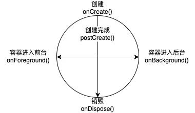

# 生命周期感知

我们基于 PlatformView 扩展了 UniPage 的概念，为了支撑复杂的 UI 或页面的嵌入，UniPage 定义了一系列简化的生命周期设计，如图：



其中，纵轴代表着 UniPage 的「创建至销毁」，横轴则代表 Flutter 容器（如 Activity）的「前台与后台」。我们希望 UniPage 仅作为平台与 Flutter 的轻量级中间层，不过度耦合某个平台专有的生命周期，因此这两条轴完全正交，意味着 UniPage 不保证创建完成后一定触发前台事件，也不保证销毁前一定触发后台事件。

## Android

在默认情况下，UniPage 可以感知自身创建至销毁的生命周期，无需单独适配。

若需要更进一步感知所在容器的前后台，可以在注册 UniPage 时，进行额外配置：

```java
UnifyUniPagePlugin.registerUniPage("demo_uni_page", DemoUniPage.class);
// ↓ 添加这条 ↓
registerActivityLifecycleCallbacks(new UniPageLifecycleCallbacks());
```

如此配置后，即可为所有 UniPage 启用 `onForeground` 与 `onBackground` 方法的感知。

## iOS
iOS端可以通过创建继承自 UniPage 的子类，根据实际需要复写本章节开头的周期函数，实现感知 UniPage 的生命周期。
下面通过实际例子表述如何实现 UniPage 各个生命周期的感知。

首先，需要创建一个 UniPage 的子类比如叫`UniPageDemo`，参考示例如下：

```objectivec
#import "UniPage.h"
@interface UniPageDemo : UniPage
@end
```
其次，根据实际需要，想感知哪个阶段的生命周期，就复写哪个生命周期函数。下面是对 UniPage 各阶段生命周期函数感知的实现举例。
#### 1. 感知UniPage创建
如果需要在 UniPage 对象创建时做一些自定义操作，可以通过重写 `onCreate`周期函数来实现，参考如下示例：

```objectivec
@implementation UniPageDemo

- (void)onCreate {
    [super onCreate];
    // Do any additional setup when creating the UniPage object.
}
@end
```
#### 2. 感知UniPage加载
如果需要在 UniPage 加载时做任何自定义配置，可以通过通过重写 `postCreate`周期函数，参考如下示例：

```objectivec
@implementation UniPageDemo

- (void) postCreate {
    [super postCreate];
    // Do any additional setup after loading the UniPage.
}
@end
```

#### 3. 感知UniPage销毁
如果需要在 UniPage 对象销毁时做一些自定义操作，可以通过复写 `onDispose`周期函数，参考如下示例：

```objectivec
@implementation UniPageDemo

- (void) onDispose {
    // Do any additional setup after UniPage object dealloc.
}
@end
```

#### 4. 感知前后台
如果希望 UniPage 页面感知 application 前后台切换状态，可以通过复写`onForeground`、`onBackground`来实现，参考如下示例：

```objectivec
@implementation UniPageDemo
- (void)onForeground {
    // Do any additional setup when application enters the frontend.

}

- (void)onBackground {
    // Do any additional setup when application enters the background.
}
@end
```
